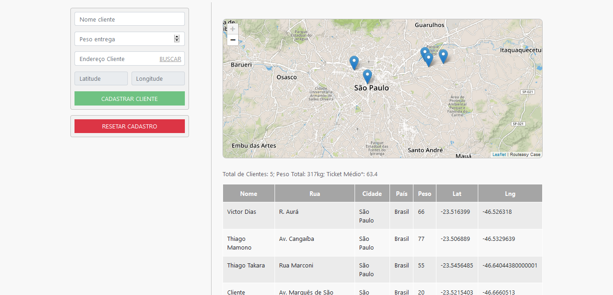

# Case Routeasy

- Back-End: API que consiste em 3 rotas:
    - (GET): Retorna todas as entregas.
    - (POST): Adiciona uma entrega.
    - (DELETE): Remove todas as entregas.
- Front-End: Cadastra a entrega, com a opção do usuário digitar o endereço e retornar a latitude e longitude com a API do Google e depois atualiza as entregas no mapa.

## Tecnologias:
* ExpressJS
* Mocha
* SuperTest
* Chai
* AngularJS
* Boostrap
* Leaflet

## Instalação:

1. Instale o Node.JS em seu computador, link: https://nodejs.org/en/.
2. Instale o MongoDB em seu computador, link: https://www.mongodb.com/.
3. Duplique o arquivo ".env_default" e renomeie para ".env" e coloque sua string de conexão com o mongodb em: "MONGODB_CONNECTION_STRING".
4. Rode o case usando o comando:

```sh
$ npm run dev
```

## Testing:

Para testar o Back-End, rode:

```sh
$ npm test
```

## Screenshots:



## Observações:

Em caso de deploy em droplets como o Heroku (https://heroku.com) troque o "DEV" por "PROD" no ".env".
